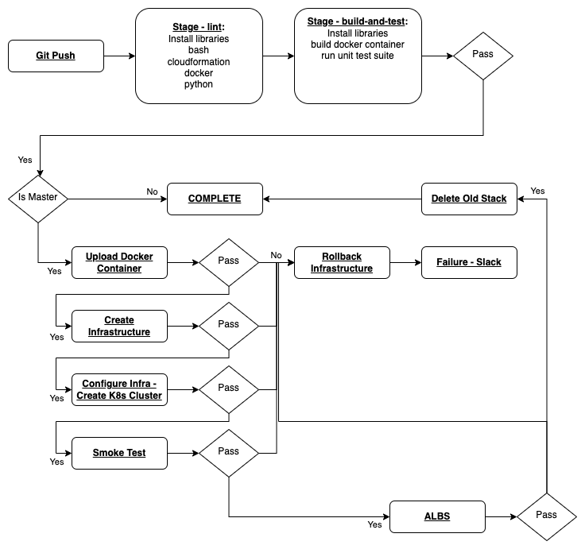

# webscraper-cluster
Web scraper microservice cluster with full CI/CD pipeline using common industry DevOps tools.

### Tech Stack
Technology         | Purpose
------------------ | ------------------
AWS                | Cloud Provider
Ansible            | IaC (Configuration Management)
Bash/Linux         | Scripting Language/OS
CircleCI           | CI/CD Tool
CloudFormation     | IaC (Infrastructure Provisioning)
Docker             | IaC (Containerization)
Flask              | Python Web Framework for REST API
Kubernetes         | IaC (Container Orchestration)
Python             | Programming Language

### Project Structure
Files/Folders      | Description
------------------ | ------------------
`.ansible/`        | Ansible Playbooks for Infrastructure
`.aws-cf-iac/`     | CloudFormation IaC Files
`.circleci/`       | CircleCI CI/CD Configuration File
`bash/`            | Bash Scripts (ie. `run_docker.sh`, `run_kubernetes.sh`, `upload_docker.sh`)
`config/`          | Configuration Files used for Application and scripts
`docs/`            | Project Documents ie. [proposal.md](docs/proposal.md), [requirements.md](docs/requirements.md), and [pipeline.drawio](docs/pipeline.drawio)/[pipeline.png](docs/pipeline.png)
`output/`          | Output Screen Shots
`src/`             | Project Applications - `scrape-api`
`tests/`           | Unit Tests
`LICENSE.md`       | License for Project
`Makefile`         | Makefile with steps: setup, install, test, lint, and all
`README.md`        | Project README file

Python App Files   | Description
------------------ | ------------------
`Dockerfile`       | Docker Build File
`requirements.txt` | Python Library requirements file

## Pipeline


## How To Run

```bash
# Initialize Infrastructure for Pipeline
./bash-create.sh webscraper-network aws-network.yml default          # NETWORK
./bash-create.sh webscraper-iam-sgs aws-iam-and-sg.yml default       # IAM AND SG
./bash-create.sh webscraper-jumpbox-default aws-jumpbox.yml default  # JUMPBOX
./bash-create.sh webscraper-servers-1 aws-servers.yml 1              # SERVERS
./bash-create.sh webscraper-alb aws-alb.yml 1                        # ALBS
```

After init, it should automatically run in Circle CI.  Ensure the following:
- CircleCI set up with ENV DOCKER_PASSWORD
