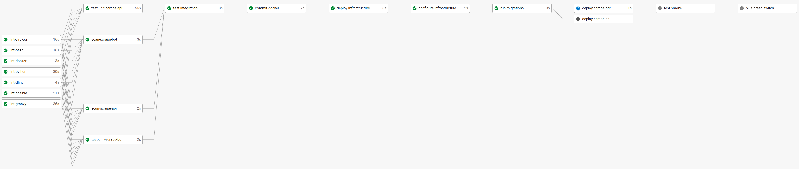

# Web Scraper DevOps Project

Web scraper microservice cluster with full CI/CD pipeline using common industry DevOps tools.  This is the 2nd iteration of the Capstone project seen at this link here: [Github johnnynguyen541/webscraper-cluster](https://github.com/johnnynguyen541/webscraper-cluster).  The main updates are:

- Tech Debt Updates
    - Refactor Ansible Playbooks and Terraform Code
    - Update New CircleCI Pipeline
- Migration of tech to more modern tech
    - From AWS CloudFormation to Terraform
    - From CircleCI to CircleCI+Jenkins
    - Using Amazon EKS
- Adding New Tech to full pipeline for observability and other purposes
    - Grafana
    - Prometheus
- Expanding the functionality
    - Updating code to have an `API service` and a `bot service`
    - Store Data in RDS
- Long term Enhancements
    - Helm (Kubernetes application management)
    - Ansible Tower (Pull Config)
    - Splunk (Logging)
    - New Relic (APM)
    - Vault (Secrets Management)
    - Packer (AMI builds)
    - GCP/Azure support? (Clouds)
    - More services for cluster/test RDS cluster
    - Config file for Python Devices
    - Swagger API/Authentification

See [Project Overview](docs/project-overview.md) for more specific info.

### Tech Stack

Technology         | Purpose
------------------ | ------------------
AWS                | Cloud Provider
Ansible            | IaC (Configuration Management)
Bash/Linux         | Scripting Language/OS
CircleCI           | CI/CD Build Tool
Docker             | IaC (Containerization)
Flask              | Python Web Framework for REST API
Grafana            | Data Visualization Tool
Jenkins            | CI/CD Build Tool
Kubernetes         | IaC (Container Orchestration)
New Relic          | Logging
Prometheus         | Infrastructure Monitoring
Python             | Programming Language
Splunk             | Logging
Swagger            | REST API Documentation
Terraform          | IaC (Infrastructure Provisioning)

### Project Structure

Files/Folders      | Description
------------------ | ------------------
`.ansible/`        | Ansible Playbooks for Infrastructure
`.circleci/`       | CircleCI Config Script
`.jenkins/`        | Jenkins Configs and Groovy Scripts
`.tfinfra/`        | Terraform IaC Files
`bash/`            | General Project Bash Scripts
`config/`          | Configuration Files used for Application and scripts
`docs/`            | Docs ie. [pipeline.png](docs/pipeline.png)
`lint/`            | Linting files
`src/`             | Project Apps - `scrape-api` - `scrape-bot`
`tests/`           | Unit Tests
`LICENSE.md`       | License for Project
`.gitignore`       | GIT ignore files
`.secrets.txt`     | Secrets file used (Currently managed by CircleCI, in .gitignore)
`Makefile`         | Makefile: setup, install, test, lint, and all
`README.md`        | Project README file

Python App Files   | Description
------------------ | ------------------
`../config.yml`    | Config files used for applications.
`app/`             | Python Application Files
`Dockerfile`       | Docker Build File
`requirements.txt` | Python Library requirements file
`run_docker.sh`    | Run Docker Container
`upload_docker.sh` | Upload Docker Container to Docker Registrt

## Pipeline

### CircleCI Pipeline

## How To Run

TBD