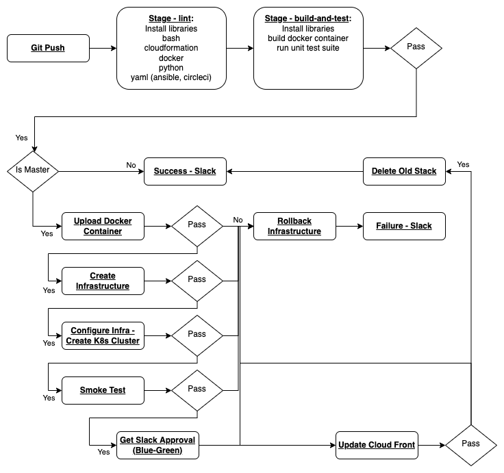

# Project Proposal

# Phase 1

## Overview
The webscraping cluster scrapes from Datanyze.  Data is accessible in API.

## Code
The `scrape-api` scrapes data from Website and returns either 404 or 200.

`scrape-api` endpoints:
- `/` and `all/`       - GET returns all endpoitns
- `/ci`                - GET returns [Top 10 CI Tools](https://www.datanyze.com/market-share/ci--319)
- `/config-management` - GET returns [Top 10 Configuration Management Tools](https://www.datanyze.com/market-share/configuration-management--313)
- `/containers`        - GET returns [Top 10 Containerization](https://www.datanyze.com/market-share/containerization--321)
- `/health`            - GET returns OK

```json
/* "/", and "all/" endpoints */
{
    "ci" : {
        "name" : "ci",                                             // Name of endpoint
        "url"  : "https://www.datanyze.com/market-share/ci--319",  // URL
        "date" : "2022:05:17__22:31:16",                           // UTC Date: date -u +"%Y:%m:%d__%H:%M:%S"
        "data" : {                                                 // Category data
            "1": {
                "Name"            : "Jenkins",
                "Companies Using" : 14919,
                "Market Share"    : 63.55
            },
            "2": {
                "Name"            : "JetBrains Team City",
                "Companies Using" : 1983,
                "Market Share"    : 8.45
            },
            ....
        }
    },
    "config-management" : {
        ...
    }
}

/* "ci/" endpoint */
{
    "name" : "ci",                                             // Name of endpoint
    "url"  : "https://www.datanyze.com/market-share/ci--319",  // URL
    "date" : "2022:05:17__22:31:16",                           // UTC Date: date -u +"%Y:%m:%d__%H:%M:%S"
    "data" : {                                                 // Category data
        "1": {
            "Name"            : "Jenkins",
            "Companies Using" : 14919,
            "Market Share"    : 63.55
        },
        "2": {
            "Name"            : "JetBrains Team City",
            "Companies Using" : 1983,
            "Market Share"    : 8.45
        },
        ....
    }
}

/* health/ endpoint */
OK  // Status code 200
```

## Pipeline


# Phase 2

## Overview
The webscraping cluster scrapes user defined websites and saves them off to S3 (potentially to be moved to an RDS or MongoDB).  Data is then accessible in an API.

## Code
This project is a Web Scraping tool consisting of `scrape-api` and a `scrape-bot`

The `scrape-api` reads data from S3 bucket and returns data of website depending on query.

`scrape-api` endpoints:
- `/` and `all/` - GET returns all data from all time stamps
- `$category/`   - GET returns all data from a category from all time stamps
- `/health`      - GET returns endpoint status
- `/status`      - GET returns list of services and status
- `/version`     - GET returns Versions for each service

Output for Data
```json
/* /, all/ and $category/ endpoints */
{
    "data_name_1" : {
        "name"     : "name_of_data",              // ie. Albertsons, Best Buy, etc
        "url"      : "website_url",               // ie. https://www.slickdeals.com
        "category" : "entry_category",            // ie. groceries, electronics, etc.
        "c-data"   : [                            // Category data
            {
                "date" : "2022:05:17__22:31:16",  // UTC Date: date -u +"%Y:%m:%d__%H:%M:%S"
                "ts-data" : {
                    ...
                }
            },
            {

            },
        ],
        "region"   : "location"         // ie. Irvine, CA or Remote
    },
    "data_name_2" : {
        
    }
}

/* status/ endpoint */
[
    {
        "name":     "scrape-api", // ie. scrape-api/bot/gui/rds, etc.
        "port":     "5000",       // ie. 5000, 80, 443, etc.
        "endpoint": "health/",    // ie. "health/"
        "status":   "up"          // ie. "up" or "down"
    },
    {
        "name":     "scrape-bot", // ie. scrape-api/bot/gui/rds, etc.
        "port":     "5001",       // ie. 5000, 80, 443, etc.
        "endpoint": "health/",    // ie. "health/"
        "status":   "up"          // ie. "up" or "down"
    }
]

/* health/ endpoint */
OK  // Status code 200

/* version/ endpoint */
[
    {
        "name":    "scrape-api", // ie. scrape-api/bot/gui/rds, etc.
        "version": "v1.0.0",     // ie. v0.0.1
    },
    {
        "name":    "scrape-bot", // ie. scrape-api/bot/gui/rds, etc.
        "version": "v1.0.0"      // ie. v0.0.1
    }
]
```

The `scrape-bot` queries all urls from config directory `config/urls.yml` and uploads them to S3 bucket

`scrape-bot` endpoints:
- `/health` - GET returns endpoint status
- `/urls`   - GET returns all the URLs and configurations
