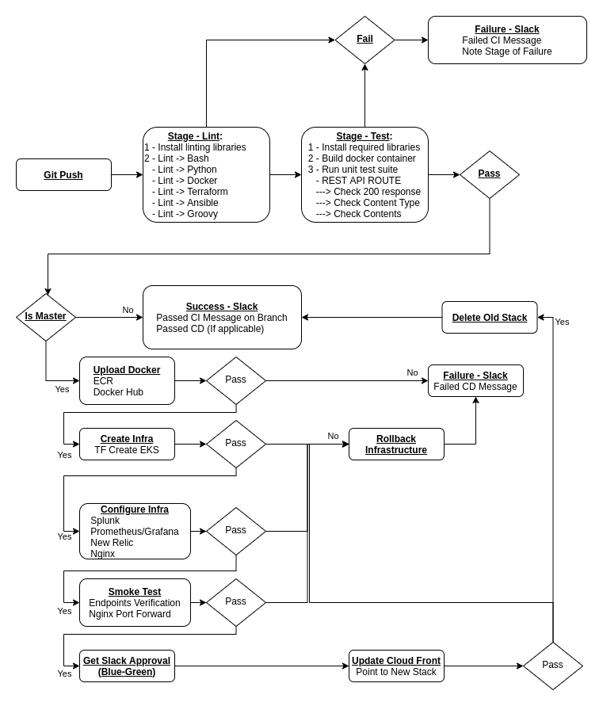

# Project Proposal

## Overview
The webscraping cluster scrapes from Datanyze.  Data is accessible in API.

## Code
The `scrape-api` scrapes data from Website and returns either 404 or 200.

`scrape-api` endpoints:
- `/` and `all/`       - GET returns all endpoitns
- `/config-management` - GET returns [Top 10 Configuration Management Tools](https://www.datanyze.com/market-share/configuration-management--313)
- `/containers`        - GET returns [Top 10 Containerization](https://www.datanyze.com/market-share/containerization--321)
- `/health`            - GET returns OK

```json
/* "/", and "all/" endpoints */
{
    "config-management" : {
        "name": "config-management",
        "url": "https://...",
        "date": "2022:05:18__18:47:50",
        "data": {
            "1": {
                "Name": "Ansible",
                "Company": "Red Hat",
                "Description": "...",
                "Number of Companies Using": 9542,
                "% Market Share": 25.35
            },
            "2": {
                ...
            },
            ...
        }
    },
    "containers" : {
        ...
    }
}

/* "config-management/" endpoint */
{
    "name": "config-management",
    "url": "https://...",
    "date": "2022:05:18__18:47:50",
    "data": {
        "1": {
            "Name": "Ansible",
            "Company": "Red Hat",
            "Description": "...",
            "Number of Companies Using": 9542,
            "% Market Share": 25.35
        },
        "2": {
            ...
        },
        ...
    }
}

/* health/ endpoint */
OK  // Status code 200
```

## Pipeline

